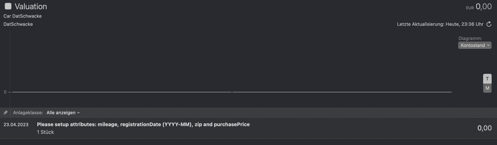
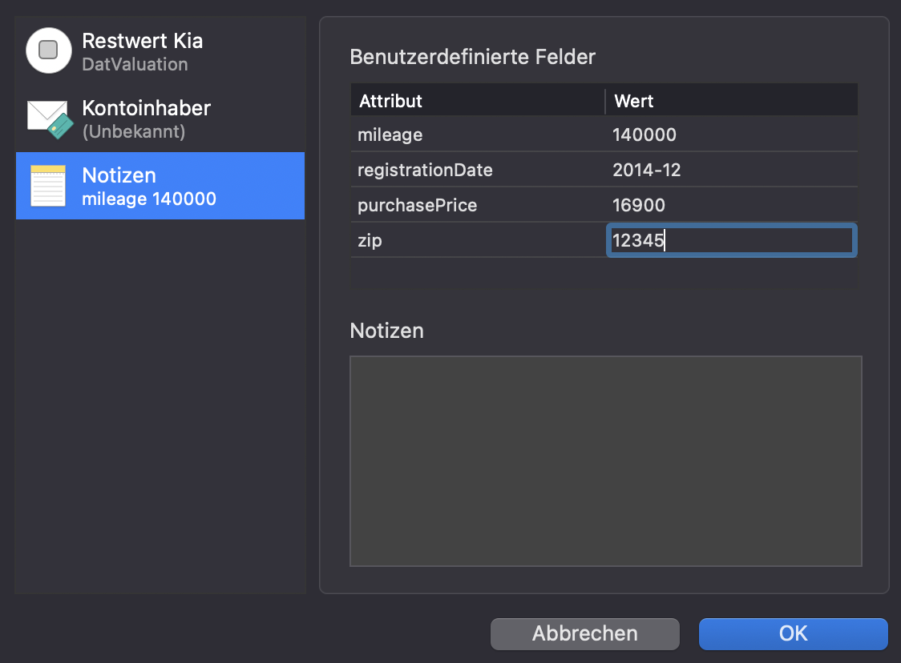
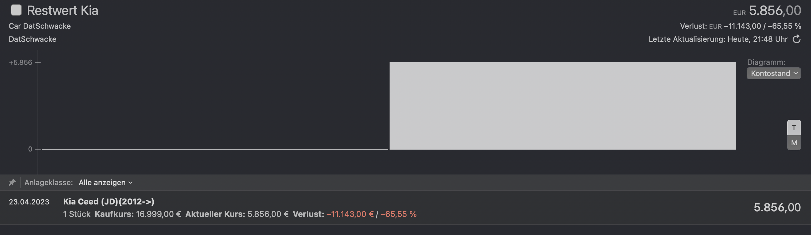

# Deutsche Automobil Treuhand Valuation for MoneyMoney
Want to know how much money you already lost on your car? Look no further, this extension
for MoneyMoney will show you exactly by fetching the current Deutsche Automobil Treuhand (DAT) Valuation.

## Howto get the correct code
- Visit [DAT Gebrachtwagenwerte](https://www.dat.de/gebrauchtfahrzeugwerte/#/start) and go through all the steps for your car until you reach the expected valuation
- Optional: get a bit sad now
- Copy the *DAT €uropa-Code®* which looks like this `01 425 022 002 0004 DE004 5404`

## Account Setup
- Username: DAT €uropa-Code® (see previous section)
- Password: Anything (is not used)

After saving, the account goes into "setup mode". Right click on the account, select "settings" and "notes".
Please add the following attributes:
- mileage: your cars mileage
- registrationDate: when the car was registered initially (in format `YYYY-MM`, notice there is no day!)
- zip: your postcode
- purchasePrice: the price you initially purchased your car

Now right click on the account again and hit "reload". The current valuation should appear.

## Screenshots from MoneyMoney
#### Setup Mode after account creation

#### Configure Account

#### Ready when you are!

